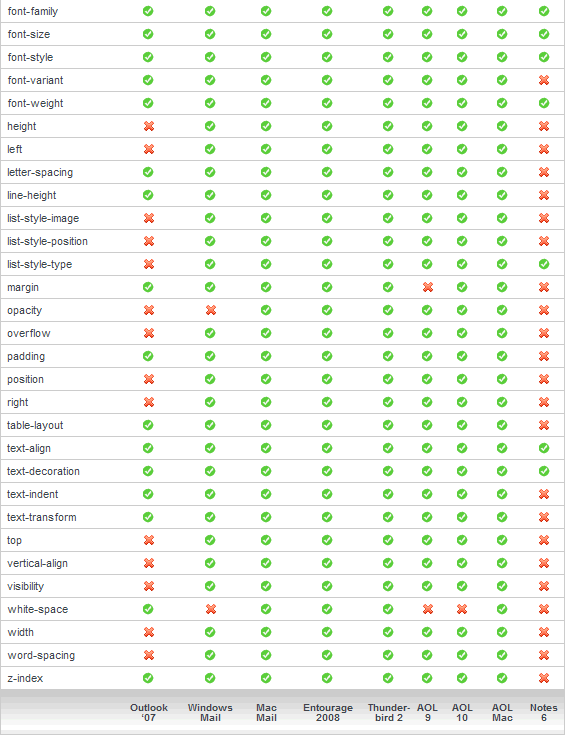
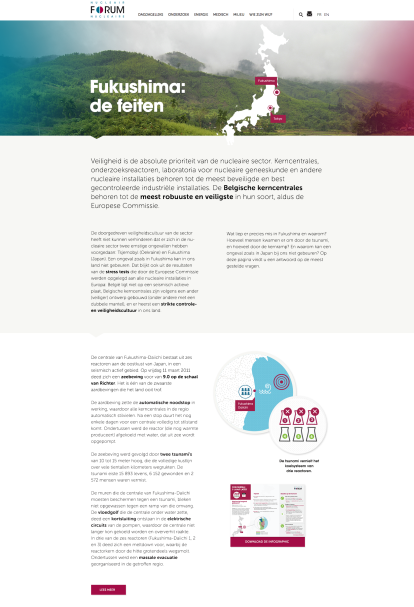

# Kleinere opdrachten
In dit hoofdstuk worden 2 kleinere opdrachten, die ik heb moeten doen voor ik aan het Pitchpoint project begon, besproken.

## Mail
De eerste week bij prophets moest ik met html/css een mail maken voor Carrefour, die deze dan doorstuurt naar zijn klanten (reclame dus).

Ik kreeg een HTML template waarop ik verder moest werken, deze template bestond uit heel veel tables. Waarom word een email niet hetzelfde gemaakt als een website gemaakt word ? 

Het verschil tussen het opstellen van een mail en een website zit in het aantal mailclients en internetbrowsers. Er zijn heel veel mailclients tegenover internetbrowsers en al deze mailclients ondersteunen een verschillende subset van html en css . Bovendien gebruiken desktop, webmail en mobiele email clients allemaal verschillende rendering engines om de content van de mail te displayen. Om dit te illustreren kunt u een voorbeeld hieronder zien van enkele mail clients en welke css properties deze ondersteunt.

<div align="center"></div>
<div align="center" style="margin-bottom:10px;"> <i>Figuur 35: Overzicht ondersteunde CSS properties bij verschillende mailclients</i></div>

Mijn taak bestond voornamelijk uit images slicen in photoshop. En deze toevoegen aan de template, de images moesten ook nog correct gepositioneerd worden. Achteraf heb ik de mail ook nog getest in een testing tool genaamd litmus , deze tool laat het toe om mails zoals dit te testen in meer dan 40 verschillende email clients.

Uit deze opdracht heb ik geleerd dat zoveel tables moeilijk zijn om mee te werken , ik had een tag ergens vergeten te sluiten met als gevolg dat heel de pagina versprong vanaf een bepaald punt. Het is niet zo evident om een niet gesloten tag te zoeken in een pagina met 1000-2000 van deze tags. Gelukkig zijn er online tools beschikbaar die dit kunnen detecteren. Ik vond het verbazingwekkend dat een 'simpele' mail van carrefour zoveel lijnen code kon bevatten. 

## Website Fukushima

Als tweede opdracht moest ik een website maken voor het Nucleaire Forum van België over [Fukushima](https://www.nucleairforum.be/energie/fukushima), omdat de feiten in Fukushima 5 jaar geleden gebeurd zijn. 

<div align="center"></div>
<div align="center" style="margin-bottom:10px;"> <i>Figuur 36: Website Fukushima</i></div>

De website is ontwikkeld met Susy als grid systeem , Sass, Tweenmax.js en Gulp als Task runner. Er werd een design (.psd file) voorzien die nagemaakt moest worden. 

Hieronder leg ik kort de technologieën uit die gebruikt zijn bij de ontwikkeling:
### Susy
Susy is een set van Sass Mixins die dienen om een responsive grid op te stellen. Het leuke hieraan is dat je volledig zelf je grid definieert en dat susy al de nodige berekeningen doet. De sass compiler zal kijken naar de mixin definities in de susy bestanden en zal deze omzetten naar css.
De mixin die het meeste word gebruikt is de span mixin :
```
.picblock {

    @include span(4 of 12);
```

deze mixin word gebruikt om de breedte van een kolom te bepalen en word berekend aan de hand van de container mixin (wrapper).
Susy staat het toe om een aantal settings in te stellen zodat je het grid helemaal kunt afstellen naar jou wensen , hieronder enkele settings die aan te passen zijn:
```
$susy: (
  flow: ltr,
  math: fluid,
  output: float,
  gutter-position: after,
  container: auto,
  container-position: center,
  columns: 4,
  gutters: .25,
  column-width: false,
  global-box-sizing: content-box,
  last-flow: to,
  debug: (
    image: hide,
    color: rgba(#66f, .25),
    output: background,
    toggle: top right,
  ),
 );

```
### Sass
Deze technologie werd uitgelegd in hoofdstuk gebruikte technologieën.

### Tweenmax.js
Er waren enkele DOM elementen die geanimeerd moesten worden. Hierbij hebben we gebruik gemaakt van Tweenmax.js
Tweenmax.js is een javascript animatie library die onderdeel is van GSAP (Greensock Animation Platform) , Tweenmax is een uitbreiding van tweenlite.js. Om deze library te gebruiken steken we deze gewoon mee in de package.json file zodat deze mee word geinstalleerd met het npm-install command , hierna hoeven we deze enkel nog te requiren in de main javascript file en alles is gereed om gebruikt te worden. Waarom GSAP ? Omdat deze library goed gedocumenteerd en dus makkelijk in gebruik is en bovendien zijn de animaties ook heel soepel (hoge framerate) dit kan je makkelijk zien met deze tool [SpeedTest](http://www.greensock.com/js/speed.html)

Hoe werkt dit nu juist ? 
Een Tweenmax instantie zal 1 of meerdere properties van eender welk DOM object aanpassen over een bepaalde tijdsperiode.
Bv: 2 markers die op de map moeten 'vliegen'
```
TweenMax.fromTo([".map__pin",".map__pin"] ,0.7 , {top:"40%", opacity:"0", visibility:"hidden"} , {top:"54%", opacity:"1", visibility:"visible"} );
```
Dit stukje code zal het object aanspreken met het ID map__pin , en de properties :top:40% , opacity:0 en visibility:hidden veranderen naar top:54% , opacity:1 en visibility:visible over de tijd van 0.7 seconden.
Zoals je ziet is hier helemaal niet veel code voor nodig , waardoor ik tweenmax.js heel aangenaam vind om mee te werken.

Al de animaties die gebeuren op de website zijn getriggerd op een bepaalde scroll hoogte die word gemeten vanaf de bovenzijde van de pagina maar doordat deze website is toegevoegd aan hun huidige website worden de animaties op de verkeerde moment getriggerd. Omdat ze een navigatie balk hebben toegevoegd klopt de juiste scrollhoogte niet meer om de animaties te triggeren met als gevolg dat deze allemaal te vroeg getriggerd worden.

### Gulp
Werd ook al besproken in gebruikte technologieën maar in dit project hebben we gulp iets anders gebruikt omdat we in het pitchpoint project gebruik hebben gemaakt van laravel elixir en hier niet.

Om de taken uit te kunnen voeren op verschillende files hadden we een src (=source) folder en een build folder nodig. De source folder gebruiken we om alles in te coderen en in de build folder word alle gecompileerde code gezet door middel van gulp zijn streams. 

Gulp maakt gebruik van plug-ins die men kan installeren om specifieke taken uit te voeren. Deze plugins kan men installeren via de npm package manager.
Hierna kan men taken declareren in de file 'gulpfile.js' die in de root van de website folder staat. De plug-ins die men wil gebruiken moeten toegevoegd worden bovenaan deze file , daarna worden de taken gedeclareerd. Een taak is opgebouwd in 3 delen :
1. Source files selecteren waarop taken moeten worden uitgevoerd.
2. Files die geselecteerd zijn worden door een pipe stream gestuurd die alle taken zal uitvoeren die gedeclareerd werden.
3. De aangepaste files zullen geplaatst worden in de build map.

In onze gulpfile hadden we verschillende taken :
- templates
 - Content nemen uit json file en in html file toevoegen zodat we 2 json files kunnen gebruiken één voor de franse en nederlandse versie van de content. Er worden nu 2 index.html files gegenereerd in de build map 1 fr en 1 nl.
 - Alle js files toevoegen aan 1 main.js.
- styles
 - Alle partials bundelen in 1 css file.
 - Sass omzetten naar css.
 - Autoprefix, produceert code zodat alles ook ondersteunt is door oudere browsers
- watch
 - voert styles en template taak uit als er iets verandert in de projectmap.
