## Bespreking ontwikkeling
In dit hoofdstuk word in grote lijnen uitgelegd hoe de applicatie in elkaar steekt en hoe alles samenwerkt met elkaar.



### Database
We hebben eerst een database schema (bijlage 1) gemaakt omdat we zo een overzicht kregen van de data en relaties in de applicatie. Voor er connectie mogelijk is moesten we de configuratie file aanpassen in de config folder van het laravel project: 
```
'mysql' => [
            'driver' => 'mysql',
            'host' => env('DB_HOST', 'localhost'),
            'port' => env('DB_PORT', '3306'),
            'database' => env('DB_DATABASE', 'pitchpoint'),
            'username' => env('DB_USERNAME', 'root'),
            'password' => env('DB_PASSWORD', 'root'),
            'charset' => 'utf8',
            'collation' => 'utf8_unicode_ci',
            'prefix' => '',
            'strict' => false,
            'engine' => null,
        ],

```
#####  MySQL
Momenteel ondersteunt Laravel 4 database systemen: MySQL, Postgres, SQLite en SQL server. Wij hebben gebruik gemaakt van een MySQL database. 
##### migrations
Migrations laten ons toe om gemakkelijk in een team met een databank te werken. Telkens een nieuwe table moet aangemaakt worden moet er een migration file worden toegevoegd. Als nu een andere developer wilt werken aan het project zal hij zijn database kunnen bijwerken of aanmaken door het `php artisan migrate` command uit te voeren. Ook een handig voordeel met het werken van migrations is dat als er iets misloopt met de databank dan kan deze helemaal opnieuw aangemaakt worden met Artisan. Migrations zijn een soort van version control van je databank , het houd een geschiedenis bij in de databank van wat er allemaal al gemigrate is. Als er nu nieuwe migrations bestaan die nog niet in deze tabel staan dan zullen deze migrations uitgevoerd worden bij het migraten met Artisan.

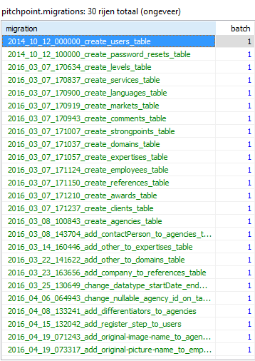
<div style="margin-top:-10px ;margin-bottom:10px; margin-left:50px;"><i>Figuur 8: migration table in de database</i></div>

Migrations kunnen gegenereerd worden met artisan en bestaan uit telkens 2 functies : 
- ** up **
Hierin worden er nieuwe tables , kolommen of indexen toegevoegd aan de databank.
- **down **
Hierin worden de nieuwe tables, kolommen of indexen die in de up methode werden aangemaakt ongedaan gemaakt.




##### Seeders
Om de applicatie te testen is het handig dat er wat test data gebruikt kan worden. Dit kan verwezenlijkt worden door het gebruik van seeders. Een seeder klasse kan gegenereerd worden met Artisan, deze klasse bevat maar één functie genaamd run en zal aangesproken worden als het artisan seed command word uitgevoerd. In deze functie word er data in de database opgeslagen door gebruik van de laravel query builder, men kan ook grote hoeveelheden van data random genereren door gebruik van de model factories. In het begin van het ontwikkelen hebben we gebruik gemaakt van seeders omdat we dan al data uit de database konden halen.

Hierna hebben we de models aangemaakt zodat we de ORM konden gebruiken om met de data uit de database te werken.

<div style="page-break-after: always;"></div>

### Model
##### Eloquent ORM
De Eloquent ORM is de built-in Object Relational Mapper van Laravel. De ORM voorziet een Active Record pattern implementatie, dit wil zeggen dat er voor elk model er aangemaakt word een bijhorende tabel is in de database. Dit geeft ons enkele voordelen die hieronder besproken worden.

 **leesbaarheid**
 
Doordat men met objecten kan werken om data uit de databank te halen blijven alle queries overzichtelijk omdat het veel gemakkelijker leest als raw SQL queries.

 **relaties**
 
Als er relaties bestaan tussen tabellen en je zou een SQL query moeten schrijven zou je elke keer volledig de relatie opnieuw moeten schrijven in SQL , bij het gebruik van Eloquent word dit gedefinieërd in het model en is daarom veel korter om te schrijven..

Om de naam van het agency van user met id=1 uit de databank te halen gebruiken we deze ORM methode:

`User::find(2)->agency()->name;`

Als we dit nu met een SQL query zouden doen dan zou het er zo uit zien:
```
select name from users join agencies
where users.id = '2'
```
Zoals je kunt zien is de syntax in deze eenvoudige query veel overzichtelijker met de ORM. Als men heel veel relaties heeft in de applicatie dan zal men met de ORM veel minder code moeten schrijven en zal men dus een overzichtelijker project hebben dan met SQL queries.

 **SQL injectie bescherming**
 
Eloquent gebruikt PDO parameter binding om SQL injectie te voorkomen. Dit wil zeggen dat gebruikers de query niet kunnen manipuleren door een bepaalde input te geven. 
<br>
Bijvoorbeeld: een input veld waar gesearched kan worden naar een telefoon nummer met als input = '036653050'; drop table users;. 

`select * from users where phone = '036653050'; drop table users;`<br>

Deze query zal de users table en alle data erin verwijderen, maar als er nu PDO parameter binding zou toegepast worden dan zou de query er zo uitzien:

`select * from users where phone = '036653050; drop table users;'`

omdat er geen telefoon nummer bestaat dat "036653050; drop table users;" bevat zal de query niets returnen. De PDO parameter binding gebeurt allemaal behind the scene doordat Eloquent de ORM methodes vertaald in SQL queries.

**Models**

Models worden aangemaakt door dit command :`php artisan make:model modelname`. Het aangemaakt model zal geplaatst worden in de map `App`. In het eloquente model worden er eerst enkele dingen gedefiniëerd zoals : 
- **Welke attributes er mass-assignable moeten zijn. **
	- Als een field als fillable word gedefiniëerd dan zal deze mass-assignable zijn. Dit wil zeggen dat als er een input array word verstuurd wanneer de gebruiker zijn form submit, dan zullen de attributes die in deze array zitten en mass-fillable zijn in 1 keer kunnen worden opgeslagen en niet allemaal apart. Als deze fields allemaal mass-assignable zouden zijn dan kan men iets meesturen met de input dat normaal niet verandert zou mogen worden bv: is_admin=true
- **Welke attributes er gecast moeten worden.**
	-  Wanneer nummers worden opgeslagen worden deze automatisch als strings gereturned, wanneer men gebruik maakt van attribute casting kan men deze casten naar een ander data type bv: int, double,... 
- **Welke attributes hidden zijn.**
	- als er bv: users uit de databank moeten gehaald worden dan zal het passwoord meegegeven worden maar als er een hidden attribute password word gedefinieerd in het model dan zal dit niet meer gebeuren. Anders zou de back-end mischien gevoelige data kunnen sturen naar de front-end en dat is niet de bedoeling.


Elke Table heeft een bijhorend model dat gebruikt word om data uit de database te halen en toe te voegen. Als er nergens expliciet word gedefinieërd welke table uit de database er gebruikt moet worden voor het model zal eloquent het meervoud van de modelnaam + enkel kleine letters uit de db gebruiken als table. bv: model User zal standaard de users table uit de db gebruiken. 

De relaties tussen de tables moesten ook gedefiniëerd worden in de Eloquente models. een Agency heeft één user maar een Agency heeft ook meerdere Werknemers. Zo zijn er wel meerdere relaties die gedefinieerd werden. Door deze relaties als functies te definieëren zal men de mogelijkheid hebben om de relaties gemakkelijk te queryen door het gebruik van method chaining. Hieronder een voorbeeld van method chaining : 

` Agency::find($id)->myDomains()`

Om deze relaties te definieren zal men eerst moeten bepalen welk type relatie er gelegd moet worden. Zo bestaan er een aantal types (die wij gebruikt hebben):
1. **One To One relationship**
Bv: one Agency has one User account
=> om deze relatie te definieren zetten we in het Agency model een methode user:
```
 public function user()
    {
        return $this->hasOne('App\User');
    }
```
2. **One To Many relationship**
Bv: one Agency has many Employees 
om deze relatie te definieren zetten we in het Agency model een methode employee: 
```
public function employees()
    {
        return $this->hasMany('App\Employee', 'agency_id')->get();
    }
```

De relatie moet ook andersom gedefinieerd worden zodat we bv de agency kunnen achterhalen aan de hand van een employee.
Dit word gedaan aan de hand van deze methode toe te voegen.
```
public function agency()
    {
        return $this->belongsTo('App\Agency');
    }
```
### Authentication
Vanaf laravel 5.2 kan men via artisan gebruik maken van de Auth scaffold . Door het command `php artisan make:auth` uit te voeren, zal men alle views genereren die nodig zijn voor authenticatie. Deze command zal volgende views genereren: 
- welcome.blade.php - the public welcome page
- home.blade.php - the dashboard for logged-in users
- auth/login.blade.php - the login page
- auth/register.blade.php - the register/signup page
- auth/passwords/email.blade.php - the password reset confirmation page
- auth/passwords/reset.blade.php - the password reset prompt page
- auth/emails/password.blade.php - the password reset email

zoals je kan zien zijn er een aantal views gegenereerd die we kunnen gebruiken in ons project.

Als we nu de Route::auth() methode zetten in de routes.php file dan zullen we de nodige routes in onze applicatie hebben om het authenticatie systeem te laten werken. Deze methode staat voor meerdere routes:
```
//authentication routes
$this->get('login', 'Auth\AuthController@showLoginForm');
$this->post('login', 'Auth\AuthController@login');
$this->get('logout', 'Auth\AuthController@logout');

// Registration Routes...
$this->get('register', 'Auth\AuthController@showRegistrationForm');
$this->post('register', 'Auth\AuthController@register');

// Password Reset Routes...
$this->get('password/reset/{token?}', 'Auth\PasswordController@showResetForm');
$this->post('password/email', 'Auth\PasswordController@sendResetLinkEmail');
$this->post('password/reset', 'Auth\PasswordController@reset');
```
Om het authenticatie systeem naar onze wensen aan te passen moesten we de registratie methode in de Authcontroller overschrijven en de $redirectTo variabele in de Authcontroller aanpassen. Deze variabele geeft aan naar waar geredirect word na het inloggen , de uri die we in deze variabele steken wijst naar een functie in de agency controller die users zal redirecten naar de laatst ingevulde stap. Ook hebben we de login en reset password views aangepast zodat dit past in het design het project.

### Routes
De gebruiker kan naar verschillende pagina's navigeren met behulp van routes. Deze routes dienen gedefinieërd te worden in de file `app/Http/routes.php`. Als er nu een request word gedaan door de client en deze is gelijk aan de gespecifieerde route uri, dan zal de server weten welke controller er moet worden aangesproken om een bepaalde functie uit te voeren en/of de juiste pagina terugsturen naar de client.

Bv: `Route::get('/{id}/step1', 'AgencyController@showStep1');`.

Deze route verteld ons dat als je naar /2/step1 surft dan zal de id='2' meegegeven worden als parameter in de showStep1 functie in de AgencyController en dan zal de eerste stap terug gestuurd worden met alle bijhorende data. Om een overzicht te zien van al onze routes word verwezen naar bijlage 2.
#### resourceful routes
We hebben gebruik gemaakt van resourceful routes , dit zijn routes die geregistreerd worden voor een resource controller. Als men een controller aanmaakt dat bijvoorbeeld requests verwerkt aangaande werknemers kan men gebruik maken van resource controllers. Deze kunnen aangemaakt worden via Artisan door het command :`php artisan make:controller EmployeeController --resource` uit te voeren. Hierna zal er een resource route worden gedefinieërd die geassocieerd word met deze controller. Deze resource route zal meerdere routes bevatten die we nodig hadden om data op te slaan , data te updaten , data te verwijderen en data weer te geven. 
<div align="center">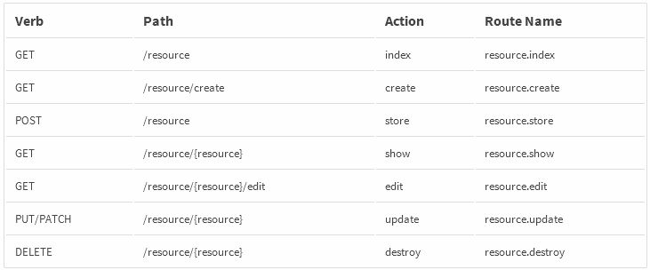</div>
<div align="center" style="margin-bottom:10px;"><i>Figuur 9: routes die bestaan in een resourceful route </i></div>

Deze routes zullen naar methodes linken in de controller. Al deze methodes worden ook al gegenereerd bij het aanmaken van de controller.

Zo hadden we enkele resourceful routes gecreeërd samen met hun bijhorende controller:
- voor werknemers van een agency
- voor awards van een agency
- voor referenties van een agency
- voor klanten van een agency
- voor commentaar over een agency
- voor sterke punten van een agency

###  HTTP Middleware
HTTP Middleware gebruiken we als filter om op bepaald requests een gepaste response te geven. Bv. middleware kan controleren of de persoon die de request stuurt geauthenticeerd is of niet.

Welke middleware hebben wij gebruikt in onze applicatie ?

- **web group middleware**
Word gebruikt voor cookies , sessies en Cross site request forgery protection. Deze middleware word toegepast op elke route in onze applicatie omdat overal sessies en cookies en CSRF protection nodig zijn deze middleware zit ingebakken in het framework.

- **Auth middleware**
Word gebruikt bij routes die enkel toegankelijk zijn voor geauthenticeerde users. Als user niet geauthenticeerd is dan zal deze een pagina krijgen met een 'unauthorized' message. Deze middleware komt ook out of the box bij het laravel framework.

- **Admin middleware**
Word gebruikt bij routes die enkel toegankelijk zijn voor geauthenticeerde users met admin rechten. Deze middleware hebben we zelf geschreven.

Middleware kan aangemaakt worden via artisan door het command `php artisan make:middleware Middlewarename` uit te voeren.
Om deze middleware te gebruiken dienen we te declareren op welke routes deze middleware moet uitgevoerd worden. Dit gebeurt in de route.php file waar alle routes staan gedefinieërd. Men kan ook groepen maken van routes waar deze middleware moet op worden uitgevoerd. Elke keer als er nu een request verstuurd word naar een bepaalde route met middleware zal eerst de code van de middleware worden uitgevoerd voordat de controller aangesproken zal worden.



### Application logic 
Onze applicatie logica word uitgevoerd door de controllers. Zoals uitgelegd bij Routes zullen HTTP requests een specifieke controller functie kunnen uitvoeren. Wij hebben 2 "hoofd" controllers :

**Admin controller**

In de admin controller worden (bijna) alle requests verwerkt die uit het admin gedeelte van de webapplicatie komen. Als er word ingelogd met een admin account zal de index() functie uitgevoerd worden.

- **index()**
Deze functie zal data van bureau's uit de databank halen, ook zal deze functie agencies rangschikken op voltooide stappen (voltooide registraties vanvoor). In deze functie word ook gedefinieërd dat als er meer dan 10 agencies zijn dan moeten deze gepagineerd worden. Als laatste zal deze functie de view admin.dashboard terugsturen samen met de data die hierin weergeven word.

- **show($id)**
als er nu op een bureau word geklikt in het dashboard dan zal deze functie worden aangesproken in de controller en dan zal de controller een nieuwe view terug sturen namelijk het overzicht van het geklikte agency met alle data die nodig is om dit weer te geven. Het $id verteld de controller op welke agency er is geklikt.

- **store( $id , Request $request)**
In het agency overzicht zal de admin commentaar, sterke punten en een laatste contactdatum kunnen toevoegen. Dit opslaan naar de databank zal gebeuren door deze functie. een request instantie word geïnjecteerd zodat men uit de huidige HTTP request de input data kan halen en opslaan. Het $id verteld de controller naar welk agency er moet worden opgeslagen.

**Agency controller**
Deze controller zal zich bezig houden met het verwerken van requests aangaande het registratie proces.
- **showStep1( $id)**
deze functie zal uitgevoerd worden wanneer een user op de registreer knop drukt. De controller zal hierna de view van de eerste registratiestap terug sturen naar de client.
- **show($id , $stepId)**
Deze functie zal alle verschillende stappen van de registratie weergeven aan de hand van een switch statement. Als parameters gebruiken we $id en $stepId , $id gebruiken we voor de correcte data van het juiste agency terug te sturen en $stepId gebruiken we zodat de controller weet welke stap er moet weergeven worden. telkens dat deze functie word uitgevoerd zal deze ook updaten tot welke stap van het registratieprocess de gebruiker alles al heeft ingevuld , dit word allemaal opgeslagen in de database. Deze waarde word gebruikt om een afbakening te maken tot waar de gebruiker allemaal kan navigeren : de gebruiker kan navigeren tot de stap na de laatst ingevulde stap , zodat er geen stappen kunnen overgeslagen worden. Deze functie zal ook een mail sturen naar de gebruiker als deze de registratie volledig heeft doorlopen. Deze mail bevat een bedankje voor de registratie en een link waar het account kan geëditeerd worden. Ook zal er een mail gestuurd worden naar pitchpoint zelf als een nieuw agency zich heeft geregistreerd , deze mail bevat de naam van het geregistreerde agency en een link naar de admin pagina van pitchpoint. Omdat we in de view aan form model binding doen om het form te hervullen moeten we telkens bij elke stap het juiste object meesturen met de view zodat dit mogelijk word.
- **store($id , $stepId , Request $request)**
Deze functie zal alle ingevoerde data van het registratie proces verwerken en opslaan in de databank. Telkens er een submit word gedaan in het registratieproces zal deze functie checken op welke stap er juist gesubmit is , hierna zal hij de juiste validatie regels in de validator steken. De data zal gevalideerd worden , als de data niet voldoet aan de regels dan zal de gebruiker geredirect worden naar dezelfde stap maar deze keer zullen er error messages meegestuurd worden zodat de gebruiker bovenaan de pagina een message te zien krijgt over oncorrect ingevulde data. Als de data wel correct gevalideerd is dan zal deze opgeslagen worden en zal de user geredirect worden naar de volgende stap.
- **downloadWorkProcess($id)**
bevat code om een file te downloaden die geupload is door een user.
- **Redirect**
redirect gebruikers die inloggen naar de laatst ingevulde stap van de registratie.
- **registerStep($stepId, $user)**
slaagt op in de database welke stap de laatst ingevulde stap is van de gebruiker.
- **sendSupportMail(Request $request)**
als een user gebruik maakt van het support formulier (om een vraag te stellen) zal deze functie een mail sturen naar pitchpoint met de desbetreffende vraag.

We hebben ook nog aparte controllers voor de resource routes (emloyees , awards, references, clients, comments, strongpoints). In employees en clients zijn er functies voor het aanmaken, updaten, verwijderen, en editeren. Bij awards , references , comments , strongpoints kan er enkel aangemaakt en verwijderd worden.

### Validation
Zoals hierboven vermeld zal de controller de binnenkomende data valideren aan de hand van een aantal regels. Hoe werkt dit nu juist ? Wel, de eerste stap is het definieëren van de validatie regels. Laravel heeft enkele out of the box validatie regels die men kan gebruiken. Hieronder een kort lijstje van de validatie regels die wij gebruiken in het project.
- **required**
	Deze field moet worden ingevuld.
- **min:#**
	Deze field moet min x aantal characters hebben.
- **max:#**
	Deze field mag max x aantal characters hebben.
- **email**
	Deze field moet een geldig email adress bevatten.
- **numeric**
	Deze field mag enkel numerieke characters bevatten.
- **unique**
	Deze field moet uniek zijn in een bepaalde database table en kolom. dus bv: email adress in de users table. 
- **between:#,#**
	Deze field moet tussen de 2 ingevulde waardes liggen.
- **integer **
	Deze field moet een integer bevatten.
- **confirmed**
	Als deze field validatie regel op bv: field password word toegepast dan zal er eenzelfde waarde in password_confirmation field moeten staan.
    
Deze regels worden allemaal opgeslagen in een array die mee word gegeven aan de validate methode. De validate methode accepteert 2 parameters , de http request met alle ingevoerde data en de array met de validatie regels. Als de validatie gelukt is zal de controller verder de functie uit voeren, maar als de validatie mislukt zal de controller de user terugsturen naar de huidige pagina maar deze keer worden de error messages meegegeven. De errors worden meegegeven in de sessie data:
```
if ($validator->fails()) {
$messages = $validator->messages();
return redirect()
->withErrors($validator)
->withInput();
}

```

De errors kunnen in de view dan benaderd worden door de $errors variabele te gebruiken.
Wij hebben problemen hiermee gehad toen we 2 dezelfde forms op 1 pagina hadden staan. De error messages werden op beide forms weergegeven terwijl er maar 1 form ingevuld was. Dit gebeurde in stap 9 waar er vorige en huidige clienten kunnen toegevoegd worden. Het enige verschil tussen deze forms is dat de huidige cliënten geen eindjaar konden invullen. Hiervan hebben we gebruik gemaakt , in de backend word gecheckt of in de request een field zit met eindjaar. Als dit aanwezig is dan worden de validator regels voor vorige clienten in de validator geladen , als dit niet zo is dan de regels voor huidige clienten. Deze Errorbag word terug gestuurd naar de frontend met als naam previous voor vorige clienten en als naam current voor huidige clienten. Op deze manier komen de error messages op de juiste plaats en zal er correct gevalideerd worden.

In de view word aan de hand van de Blade templating engine een if geschreven dat als er een error message van een bepaalde field in de errorbag zit, dat deze field een css klasse met rode border moet krijgen. Hierdoor is makkelijk te zien waar de validatie fout zich bevind in de form.
```
 {!! Form::text('box', null, $errors->has('box') ?  ['class'=>'form__text form-control has-errors'] :
 ['class'=>'form__text form-control'])
 !!}
```




### Views
Wij hebben in onze views gebruik gemaakt van de built-in templating engine genaamd blade. Als men blade in een view wilt gebruiken dient de view file de blade.php extentie te hebben. 2 grote voordelen die we hiermee hebben zijn het gebruik van template overerving en het gebruik van secties.
Wij hebben voor onze applicatie een aantal standaard layouts gemaakt waarvan andere pagina's zullen overerven. 
- **Master layout**
	Elke pagina erft hiervan over => deze pagina bevat meta properties, link naar css file en link naar js file.
- **Admin layout**
	Bevat de standaard layout van het admin gedeelte van de applicatie.
- **Simple layout**
	Bevat de standaard layout die gebruikt word bij het editeer scherm van Employees en Clients en bij de support en legal agreement pagina.
- **step layout**
	bevat de standaard layout voor de verschillende stappen van het registratieprocess.

In deze layout files hebben we sections gecreeërd aan de hand van @yield directives. Deze kunnen we in de child pages (pages die overerven) vullen aan de hand van @section directives. Deze aanpak zorgt ervoor dat al de code die in de layout files staat maar 1 keer geschreven moet worden terwijl deze voor meerdere pagina's word gebruikt. Hieronder een voorbeeld van oververving in onze applicatie.

De** master.blade.php layout** is de layout waar elke pagina van overerft , het bevat de css/js links, metadata en een yield directive die gebruikt word om de inhoud van sections uit child pages te injecteren.
<br>
<div align="center"></div>
<div align="center" style=" margin-bottom:10px;"><i>Figuur 10: master layout</i></div>


**step.blade.php layout** is de layout die gebruikt word in alle stappen van het registratieproces, zoals voorheen vermeld zal deze pagina (net zoals elke pagina) overerven van de master layout. Om de yield directives van de master layout te vullen moesten er @section directives worden gedeclareerd met daarin de code die geinjecteerd moet worden.
<br>
<div align="center"></div>
<div align="center" style=" margin-bottom:10px;"><i>Figuur 11: Layout voor de stappen van het registratie proces</i></div>

<div style="page-break-after: always;"></div>

**step2.blade.php** Erft over van de step layout en zal de content en title sections vullen.
<br>
<div align="center"></div>
<div align="center" style=" margin-bottom:10px;"><i>Figuur 12: Stap 2 view</i></div>

Als er nu een view gestuurd moet worden naar de client zal de templating engine één view renderen aan de hand van deze 3 blade files.



### data weergeven
##### Viewbag
Telkens er een pagina word geladen door de controller zal de controller data meesturen die weergegeven moet worden in de view. Deze data sturen we mee in de vorm van een multidimensionele array genaamd de viewbag.
Hieronder een voorbeeld van de viewbag voor het weergeven van register stap 2.
```
array:3 [▼
  "agency" => Agency {#279 ▶}
  "languages" => array:5 [▶]
  "employees" => Collection {#284 ▼
    #items: array:1 [▼
      0 => Employee {#282 ▼
        #fillable: array:9 [▶]
        #connection: null
        #table: null
        #primaryKey: "id"
        #perPage: 15
        +incrementing: true
        +timestamps: true
        #attributes: array:16 [▼
          "id" => 1
          "firstName" => "Nick"
          "lastName" => "Lauwerijs"
          "picture" => ""
          "previousEmployers" => "AP"
          "brands" => "Mobistar"
          "phone" => "0494 79 15 93"
          "email" => "nlauwerijs@prophets.be"
          "startYear" => 2016
          "function" => "developer"
          "agency_id" => 2
          "language_id" => 3
          "created_at" => "2016-05-17 16:14:53"
          "updated_at" => "2016-05-17 16:14:53"
          "deleted_at" => null
          "original_filename_picture" => ""
        ]
        #original: array:16 [▶]
        #relations: []
        #hidden: []
        #visible: []
        #appends: []
        #guarded: array:1 [▶]
        #dates: []
        #dateFormat: null
        #casts: []
        #touches: []
        #observables: []
        #with: []
        #morphClass: null
        +exists: true
        +wasRecentlyCreated: false
      }
    ]
```
Hoe word dit nu weergegeven in de view ? Als we alle werknemers willen weergeven zullen we met een foreach loop door de array met index employees lopen.
```
@foreach($viewbag['employees'] as $employee)
   @include('includes.previews.employee')
@endforeach
```
Dit wil zeggen dat voor elke werknemer in de viewbag men de employee view moet includen en in deze employee view renderen we de werknemer data. De naam geven we weer op deze manier:
`$employee->name`


##### Dubbele curly braces
Zonder het gebruik van een templating engine zouden we telkens de data moeten echoën op deze manier:

`<p><?php echo $employee->firstname; ?></p>`

maar doordat blade alles dat tussen dubbele curly braces vertaald in echo's hoeft dit niet meer. Dit geeft de template een nettere syntax en zorgt ervoor dat er minder code moet worden geschreven. 

Als men dubbele curly braces gebruikt dan zal de templating engine automatisch de content escapen. Dit wil zeggen dat er bescherming is tegen cross site scripting , als een gebruiker nu html tags invoert en deze worden terug weergegeven dan zullen alle HTML entiteiten geëscaped worden.


We hadden ook een rich text editing functie toegevoegd waarbij we de content die weergegeven werd niet mocht geëscaped worden omdat de opmaak zichtbaar moest zijn. Hiervoor konden we dus niet de templating engine gebruiken omdat deze alle tags escaped, dus om dit op te lossen maakten we gebruik van een package genaamd purifier. Deze package zal alle html tags die gebruikt worden voor de opmaak toelaten en alle andere tags zullen geëscaped worden. Omdat dit in de backend niet goed werkte (cleanen voordat opgeslagen word)
word de content nog eens gecleaned in de view. Dit doen we op deze manier: 
`{!! clean($agency->philosophy) !!}`


##### Lang files
De statische content van de pagina renderen we door het gebruik van language files. Op deze manier is het heel makkelijk om meerdere talen toe te voegen aan de applicatie , momenteel was dit nog niet noodzakelijk maar als het toch ooit eens geimplementeerd moet worden is dit niet zoveel extra werk. Een language file bestaat uit een return met een array in met de statische content. 
voorbeeld van lang file:
```
return [

	'edit' => [
		'title' => 'Edit Client',

		'b1' => 'Save',
		'b2' => 'Cancel',

		'b3' => 'Upload logo',
		'b3a' => 'Select logo',

		'e1' => 'Only .jpg, .jpeg, .gif and .png formats are supported.',
	],
];
```
De titel kan men dan weergeven in de view op deze manier :
`@lang('client.edit.title')`

### Data opslaan

Data ingeven doen we aan de hand van forms. Om forms te gebruiken in het laravel framework moeten we een dependency toevoegen via composer omdat dit niet meer in de core van het framework zit sinds versie 5.0. 

##### Form model binding
Omdat alle gegevens die worden ingegeven geëditeerd moeten kunnen worden, hebben we ervoor gezorgd dat het form automatisch ingevuld word op basis van het object dat meegestuurd word naar de view. Dit hebben we gedaan aan de hand van model forms, een model form word geopend op deze manier: 
`{!! Form::model($agency, array('files' => true, 'id'=>'new__agency', 'class'=>'form--top-page')) !!}`

Als hierna een form element gedefiniëerd word met als naam hetzelfde als een attribuutnaam van het bijhorende model($agency) dan zal dit form element gevuld worden met data uit de database. Op deze manier kan de user heel het account editeren.

Er is 1 moment wanneer het form niet mag gevuld worden met data uit de databank namelijk na een validatie fout. Om de gebruiker een aangename gebruikservaring te geven worden na validatiefouten de forms gevuld met de data die gevalideerd werd zodat makkelijk aangepast en terug gesubmit kan worden. Als er in de sessie data een item is met dezelfde naam als een input veld dan zal dit sessie-item gebruikt worden om het inputveld te vullen.

##### Data sturen naar controller en opslaan naar de databank
Wanneer een form word ingevuld moet er op de save knop gedrukt worden om de data op te slaan en naar de volgende stap te gaan. Vanaf op deze knop word gedrukt zal er een POST HTTP request worden verstuurd naar de server. Aan de hand van de gedeclareerde route URI's zal een functie in de controller worden uitgevoerd. Om met de request te werken moeten we een instantie van de Request klasse injecteren in de controller. Dit doen we door het te type-hinten in de constructor. 

`public function store($id, $stepId, Request $request)`

Deze instantie bied ons enkele methodes die we kunnen gebruiken om de input data te behandelen zoals:
```
$input = $request->all();
$request->has('name')
```

Al de data die in $input zit en fillable is kan gesaved worden op deze manier:
```
$agency->fill$input);
$agency->save();
```
De data die niet fillable is moet men apart opslaan bv:
```
$newPassword = $input['password'];
$user->password = bcrypt($newPassword);
$user->save();
```

### Making the application dynamic
Om onze web applicatie interactief en dynamisch te maken hebben we gebruik gemaakt van javascript/Jquery. Hierdoor kunnen we bv. inputs limiteren, animeren van elementen, reageren op mouseclicks zonder page refresh, berekeningen doen,... Zo hadden we heel wat javascript bestanden die we samen bundelen met behulp van browserify. Dit helpt ons om beter onderhoudbare code te schrijven door het opsplitsen van verschillende javascript files die uiteindelijk gecompileerd worden naar 1 main javascript bestand. Dit laat ons toe om op een modulaire manier code te schrijven. Hoe gebeurt dit nu juist ? We hebben een main.js bestand in de root van de javascript folder , hierin requiren we andere javascript files. Als we nu gulp runnen dan zal browserify al deze javascript files compileren in 1 groot javascript bestand.
Welke verschillende javascript files hebben we allemaal gebundeld en wat is hun functie in ons project ? 
- **awards.js**
animatie voor het weergeven van het awards form voor een award toe te voegen.
- **bootstrap-dropdown.js**
code voor de multiselect die gebruikt word voor het selecteren van services voor klanten van een agency.
- **checkUrl.js**
word gebruikt voor het formateren van een url input.
- **clients.js**
animatie voor het weergeven van het clients form om een client toe te voegen + het toevoegen van een has-errors klasse om een red border weer te geven bij validatie fout , hier moest dit gedaan worden met javascript omdat dit niet werkte bij de multiselect op de gewone manier (via de templating engine).
- **dashboard.js**
enkele animaties voor het tonen/hiden van buttons + een check-all functie voor de search filters in het dashboard.
- **disableButton.js**
word gebruikt om buttons op een disabled state te zetten.
- **employee.js**
animatie voor het weergeven van het employee form voor een employee toe te voegen.
- **enableEditor.js**
Het enablen van een rich text editing functie op sommige textarea fields.
- **expertises.js**
bevat de logica om expertises te selecteren met een bepaalde level , eenmaal deze is geselecteerd kan er een percentage aan deze expertise worden meegegeven. In deze js file staat ook een teller die controleerd of het totaal van de geselecteerde percentages gelijk is aan 100%. Als dit het geval is zal de save button actief worden.
- **fallbackDatepicker.js**
Fallback voor elke browser die geen html datepicker ondersteunt. Deze js file zal detecteren of de browser het datepicker element ondersteunt , zoniet dan zal deze een jquery ui datepicker laden.
- **imagePreview.js**
Zorgt ervoor dat als de user een image selecteerd dat deze instant gepreviewd word op de pagina.
- **jquery-ui.min.js**
jquery-ui file voor datepicker functie.
- **limitInput.js**
word gebruikt om inputs te limiteren zodat er op een bepaalde char count geen chars meer kunnen worden ingegeven + de gebruiker zal bij het typen van de laatste 10 chars een counter te zien krijgen met de resterende chars die nog kunnen getyped worden.
- **markets.js**
bevat de logica om percentages te tellen van verschillende markets. als het totaal gelijk is aan 100% dan zal de save button actief worden.
- **mobile-nav.js**
animatie en weergave van de navbar als deze mobiel word weergeven.
- **modernizr-custom.js**
Tool die gebruikt word om te checken of een bepaald html element ondersteunt word door de browser , een custom versie zodat het js bestand zo klein mogelijk blijft.
- **numericInput.js**
zorgt ervoor dat op sommige velden enkel numerieke characters kunnen worden ingegeven. Zorgt ook voor het formateren van telefoon nummers en geld bedragen.
- **print.js**
zorgt ervoor dat de admin kan aanklikken wat er mee moet afgeprint worden en wat niet.
- **references.js**
animatie voor het weergeven van het references form om referenties toe te voegen.
- **RichtextEditor.js**
bevat de Rich text editor.
- **saveWarning.js**
zorgt ervoor dat als men form aanpassingen heeft gedaan en als men ergens naar wilt navigeren dat de user een melding krijgt die zegt dat niet alles is opgeslagen met dan als keuze om door te gaan of op deze pagina te blijven.
- **smoothScroll.js**
zorgt voor een smooth scroll effect.
- **vat.js**
formateren van het vat veld.

### Design
Het design van de applicatie hebben we gekregen in de vorm van een psd. Dit is een photoshop bestand waar heel het design van de applicatie opstaat. Het is een guideline om onze CSS en HTML te schrijven.

<div style="page-break-after: always;"></div>

## Bespreking van de applicatie
In dit hoofdstuk word de werking van de applicatie besproken aan de hand van afbeeldingen.
### hoofdpagina

Dit is de hoofdpagina van de applicatie, hier heeft gebruiker de keuze om in te loggen of om de registratie van een communicatie bureau te starten. Op deze pagina kan men ook naar de passwoord reset pagina gaan zodat de gebruikers hun wachtwoord kunnen resetten aan de hand van een mail. Ook hebben de gebruikers de mogelijkheid om naar de support pagina te gaan om daar via een form een mail te sturen naar de mensen van pitchpoint als ze enige vragen hebben.

### registratie stap 1

Op de eerste stap moet de gebruiker zowel algemene info ingeven over het communicatiebureau als de login gegevens om het account terug te kunnen editeren. ields zoals phone/website/VAT Nr worden live geformateerd naar het juiste formaat, ook kunnen geen letters getypt worden in fields waar enkel nummers verwacht worden,dit komt de gebruikservaring ten goede.
Als er nu een geregistreerd communicatie bureau zijn wachtwoord wilt aanpassen dan zal er een extra field staan namelijk Old password zodat eerst het vorige passwoord moet worden ingegeven voordat het pas verandert kan worden.

<div align="center">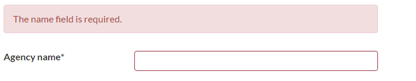</div>
<div style="margin-top:-5px; margin-bottom:10px" align="center"><i>Figuur 13: validation error in view</i></div>

Als validatie niet gelukt is zal er een error message worden weergeven bovenaan de pagina , de velden waar de validatie is mislukt zullen een rode border krijgen zodat makkelijk gezien kan worden waar de foute input zit.
### registratie stap 2

Op stap 2 moet de gebruiker info ingeven over de grootte van het communicatiebureau, of ze deel zijn van een netwerk en of ze samenwerkingen hebben met externe partners. In de netwerk en samenwerking fields kan men de tekst opmaken aan de hand van een rich text editing functie die op de textarea's staat.

<div style="page-break-after: always;"></div>

### registratie stap 3

In stap 3 moet men de belangrijkste werknemers ingeven. Op deze pagina kan men meerdere werknemers toevoegen. Door op de add new knop te drukken zal er een form verschijnen om de werknemergegevens in te geven samen met 2 knoppen: een cancel en add knop. Alle fields zijn verplicht in te vullen buiten de foto , als er geen foto word geselecteerd dan zal er een random generated gravatar worden toegevoegd als foto.



als er een werknemer word toegevoegd zal de pagina refreshen en zal de werknemer te zien zijn op de view. Als er nu geklikt word op de werknemer zal deze openschuiven om meer info te laten zien en de gebruiker de optie te geven om de werknemer te verwijderen of aan te passen. Als men op aanpassen klikt dan zal men geredirect worden naar een editeerpagina waar alle gegevens van de werknemer aangepast en opgeslagen kunnen worden.

#### registratie stap 4
In deze stap krijgt het bureau de mogelijkheid om wat meer te vertellen over zijn bedrijfsfilosofie , en hoe het werk proces van het bureau in elkaar zit. Dit kan ingegeven worden aan de hand van 2 text area's met rich text editing functie. Ook is er de mogelijkheid tot het uploaden van een bestand zodat er op deze manier ook info kan gegeven worden over het werk proces.

### registratie stap 5

In deze stap kan het bureau enkele expertises aanduiden samen met een bepaald expertise level. Als deze expertises worden aangeduid zullen deze verschijnen bij de sectie omzet percentage, ook kunnen er custom expertises worden toegevoegd door de 'other' velden te gebruiken. Bij omzet percentage zal het bureau moeten aanduiden hoeveel percentage van de omzet elke expertise opbrengt aan de hand van een slider. Links naast de sliders staat de resterende percentage die gebruikt kan worden in de sliders als die niet 0 is staat dit in het vet rood. De save knop is niet actief vooraleer het percentage 0 is.

### registratie stap 6 

Bij deze stap moet het bureau aanduiden in welke markten het bureau ervaring heeft alsook hoeveel procent van de omzet ze verdienen in elk van deze markten. Net zoals bij stap 5 zal men het resterende percentage links van de markten kunnen zien en zal de save knop niet actief zijn vooraleer het resterende percentage 0 is.

### registratie stap 7
In deze stap moet het bureau specifieke talenten beschrijven , ook moet het bureau zichzelf onderscheiden en beschrijven waarom ze uniek zijn in het main differentiators veld. Beide velden heeft ook een rich text editing functie zodat de tekst opgemaakt kan worden.



### registratie stap 8
Op deze pagina kunnen bureau's hun awards en referenties ingeven. Men kan awards of referenties toevoegen door op het bijhorende + icoontje te drukken, hierdoor zal er een kader openschuiven waarbij de gegevens ingegeven kunnen worden. Onderaan deze kader staat een knop om de award/werknemer op te slaan of om het toevoegen te annuleren. Als er een award of referentie toegevoegd word zal de pagina refreshen en zal de toegevoegde award/referentie hier te zien zijn. Deze zijn niet meer aan te passen maar kunnen verwijderd worden door op delete award of delete reference te drukken.

### registratie stap 9

Op deze pagina kan men de huidige en vorige clients ingeven door op de bijhorende add new knop te drukken. Als je drukt op deze knop zal er een  kader openschuiven waar alle gegevens kunnen worden ingegeven. Hier weer hetzelfde als bij stap 3, als er geen Logo is geselecteerd dan zal er een random generated gravatar als Logo worden gebruikt. Als er nu een client word toegevoegd dan zal pagina refreshen en zal deze te zien zijn in de view. Als men nu op de client klikt dan zal deze openschuiven om meer info te laten zien en dan heeft men de optie om de client aan te passen of te verwijderen. Als men op aanpassen drukt zal men naar een editeerpagina worden geredirect waar de gegevens aangepast en opgeslagen kunnen worden.

### registratie stap 10
Als het bureau op deze pagina komt wilt dit zeggen dat de registratie is afgelopen. Het bureau krijgt nu een overzicht van alle ingevoerde data , en kan deze aanpassen als dit nodig is door terug naar de desbetreffende stap te gaan. Het bureau krijgt ook de mogelijkheid om dit overzicht via een knop af te drukken. Bij deze laatste stap krijgt het bureau ook een mail met een bedankje voor de registratie. Pitchpoint krijgt ook een mail maar dan om Pitchpoint op de hoogte te houden dat er een nieuw bureau zich heeft geregistreerd.
 

### Navigatie
De gebruiker kan navigeren naar de stap na de laatst gesavede stap. Als de gebruiker de registratie tot en met stap 6 heeft ingevuld en je logt opnieuw in dan zal je automatisch naar stap 7 worden geredirect dit zorgt ervoor dat als de registratie niet volledig was afgerond en er opnieuw ingelogd word er meteen verder kan gegaan worden met de registratie.

Navigeren kan via de Previous en Save buttons op elke stap of via de navigatie balk bovenaan elke pagina. 

Enkel de Save button zal de input op de pagina opslaan er word dus NIETS opgeslaan als men navigeert via de  navigatie balk. Om te voorkomen dat er dan toch info zou verloren gaan omwille dat mensen navigeren (en denken dat alles opgeslagen word) via de navigatiebalk, word er een alert weergegeven wanneer er geklikt word op de navigatiebar als er iets van form input verandert is.

<div align="center"></div>
<div style="margin-bottom:10px;" align="center"> <i>Figuur 14: Alert wanneer iemand navigeert zonder te saven</i> </div>

Als er op OK geklikt word dan zal de user naar de geklikte pagina genavigeerd worden , als er op Annuleren word gedrukt dan zal de user op de huidige pagina blijven.

### Admin pagina: Dashboard

Op deze pagina krijgt Pitchpoint een overzicht van alle geregistreerde communicatiebureau's, er is een search functie beschikbaar waarmee je naar bureau's kunt searchen of men kan bureau's filteren aan de hand van specifieke expertises/markets. Vanaf dat er meer als 10 bureau's verschijnen op deze pagina , zullen deze gepaginate worden. Dit wil zeggen dat er een paginering plaats gaat vinden met 10 bureau's per pagina. Als een bureau niet volledig geregistreerd is dan zullen deze zich achteraan de lijst bevinden en zal hun kader grijs zijn ipv groen zodat pitchpoint kan zien dat de registratie niet volledig is. 

### Admin pagina: Bureau overzicht
Wanneer nu op een bureau word geklikt zal er een overzicht geopend worden dat ongeveer gelijk is aan het overzicht die het bureau te zien krijgt op het einde van de registratie. 

Enkel krijgt de admin enkele extra opties 
- aanduiden of employees mee moeten afgedrukt worden of niet.
- toevoegen van commentaar 
- toevoegen van sterke punten
- toevoegen van contact historiek
- toevoegen laatste update
- navbar rechts van de pagina waarmee men kan navigeren naar het dashboard, het bureau kan editeren, overzicht kan afdrukken.

<div align="center">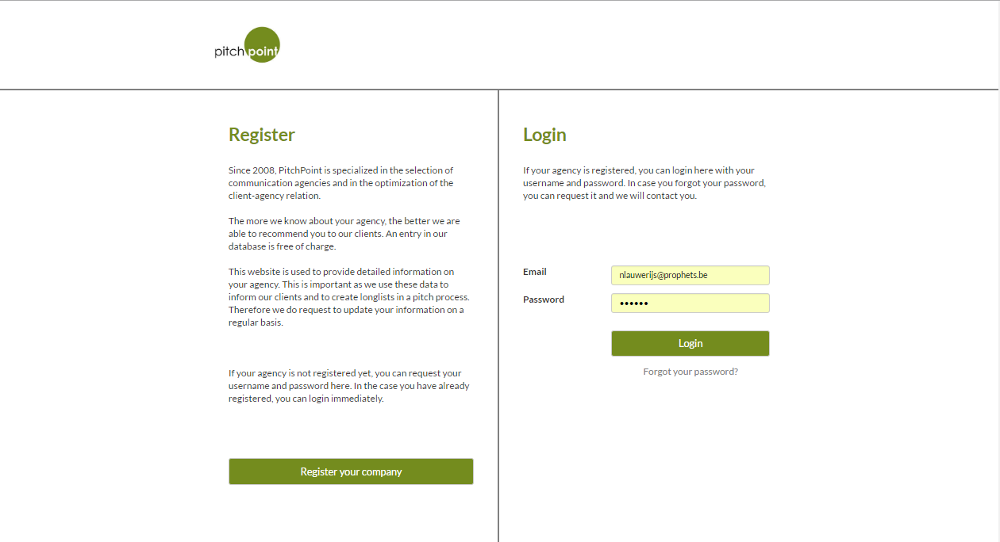</div>
<div align="center"><i>Figuur 15: Hoofdpagina</i></div>

<div align="center">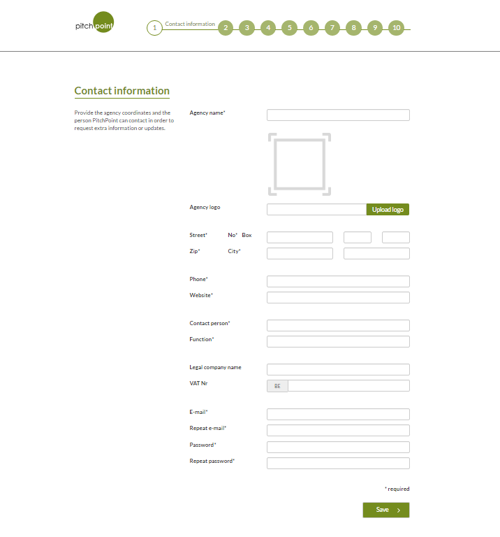</div>
<div align="center"><i>Figuur 16: register stap 1</i></div>

<div align="center">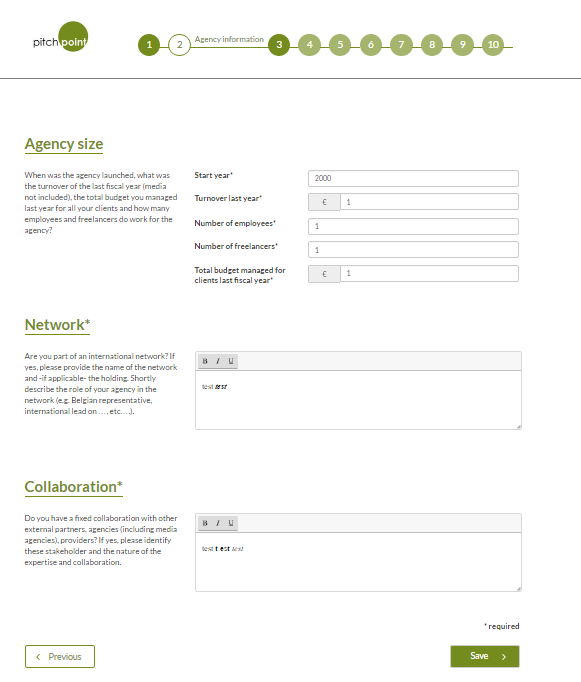</div>
<div align="center"><i>Figuur 17: register stap 2</i></div>

<div align="center">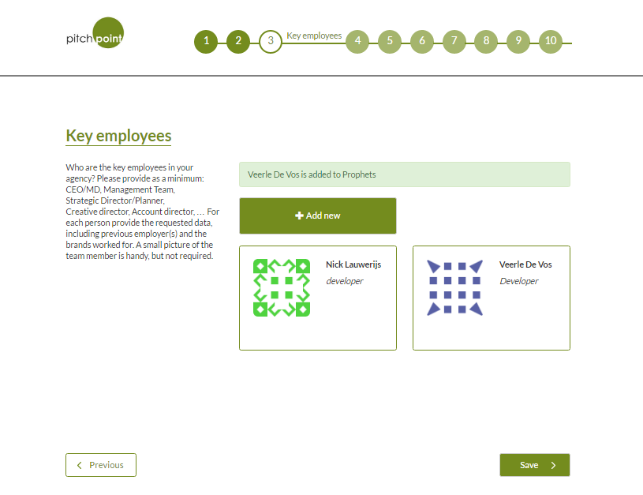</div>
<div align="center"><i>Figuur 18: register stap 3</i></div>

<div align="center">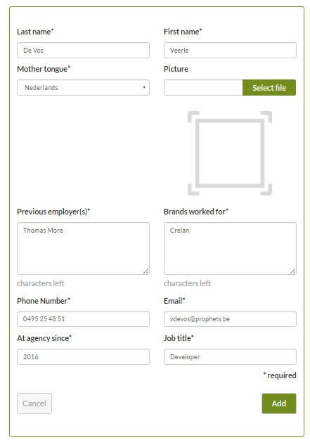</div>
<div align="center"><i>Figuur 19: Form om werknemers toe te voegen (stap 3)</i></div>

<div align="center"></div>
<div align="center"><i>Figuur 20: register stap 4</i></div>

<div align="center">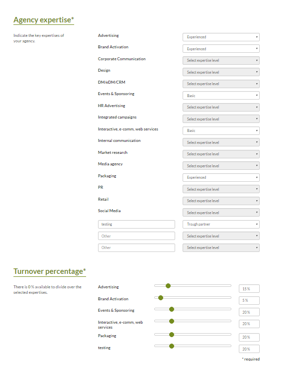</div>
<div align="center"><i>Figuur 21: register stap 5</i></div>

<div align="center"></div>
<div align="center"><i>Figuur 22: register stap 6</i></div>

<div align="center"></div>
<div align="center"><i>Figuur 23: register stap 7</i></div>

<div align="center">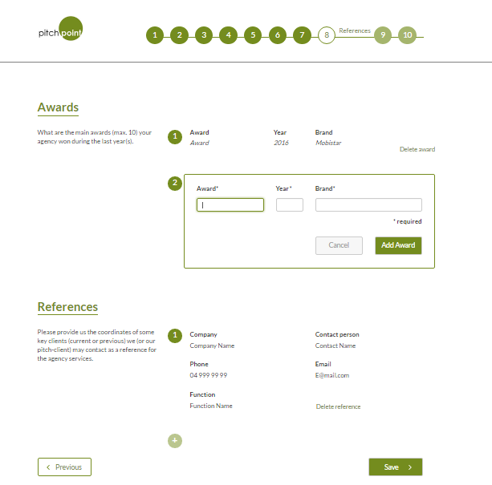</div>
<div align="center"><i>Figuur 24: register stap 8</i></div>

<div align="center"></div>
<div align="center"><i>Figuur 25: register stap 9</i></div>

<div align="center">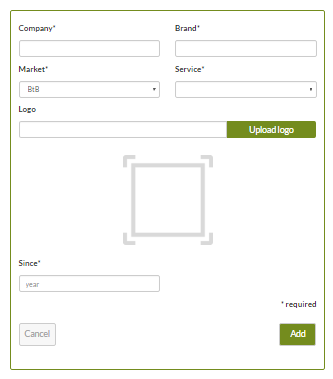</div>
<div align="center"><i>Figuur 26: Form om klanten toe te voegen (stap 9)</i></div>

<div align="center">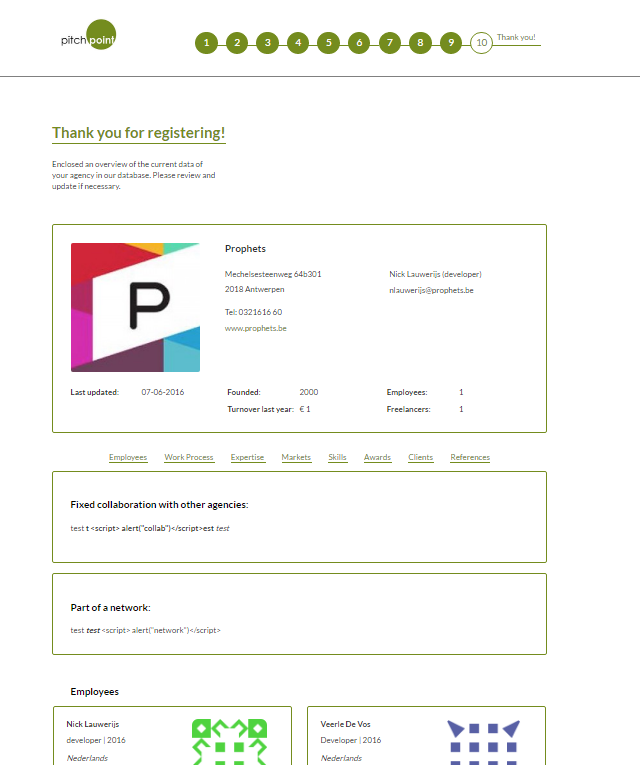</div>
<div align="center"><i>Figuur 27: register step 10 (overzicht registratie)</i></div>

<div align="center">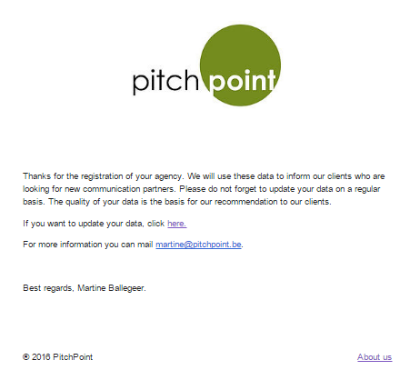</div>
<div align="center"><i>Figuur 28: Mail die gestuurd word naar user die zich registreert</i></div>

<div align="center"></div>
<div align="center"><i>Figuur 29: Mail die pitchpoint krijgt zodat ze op de hoogte zijn van een nieuwe registratie.</i></div>

<div align="center">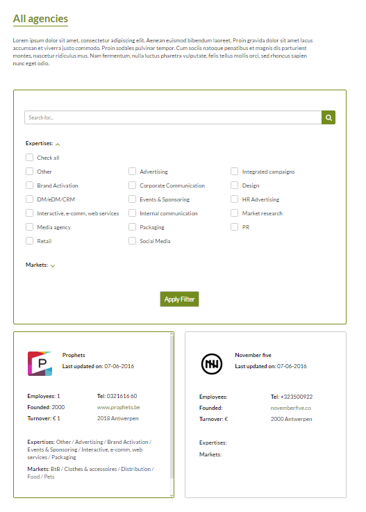</div>
<div align="center"><i>Figuur 30: Admin dashboard</i></div>

<div align="center">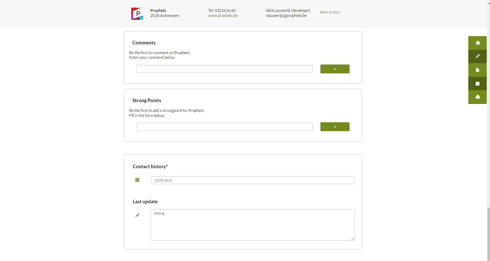</div>
<div align="center"><i>Figuur 31: bureau overzicht in admin gedeelte.</i></div>
