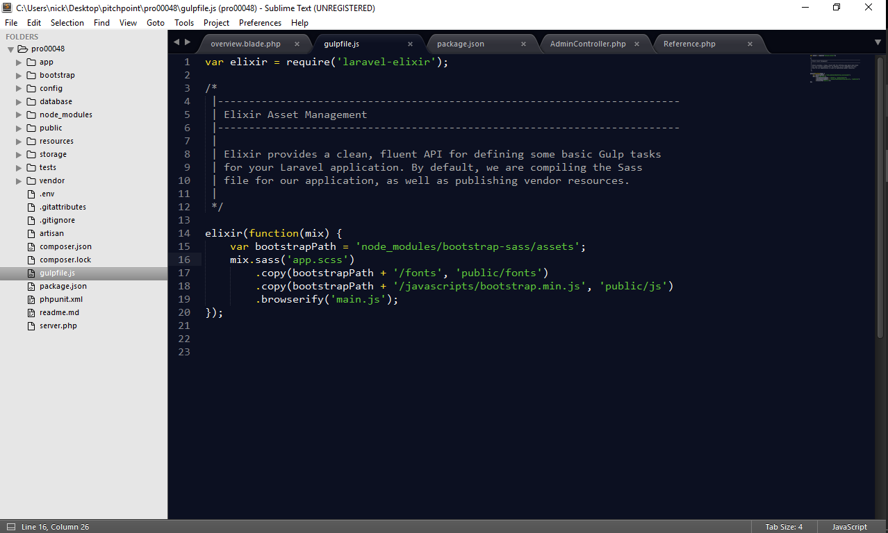
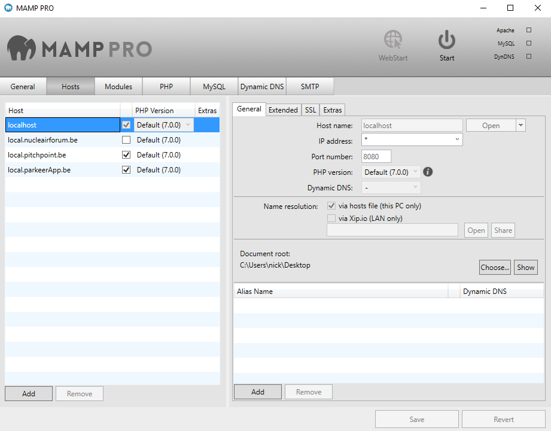

## Gebruikte software
### Sublime Text 3 
Voor dit project hadden we een text-editor nodig. Eerst maakte ik gebruik van Visual Studio Code maar omdat iedereen bij Prophets gebruik maakte van Sublime Text heb ik toch de stap gemaakt om dit ook te gebruiken omdat het makkelijker is om hulp te krijgen als ik enkele vragen had. Sublime text is één van de populairste text-editors voor web development. Het bied ondersteuning voor plugins, dit kan heel handige extra features bieden zoals css properties sorteren, code formatteren, Browser support checken bij CSS properties,...
Één van de beste features van sublime is de hoeveelheid keyboard-shortcuts dat er kunnen gebruikt worden, dit is ongeloofelijk handig voor de ontwikkelaar omdat het heel vlot werkt. 
Ontwikkelen met dit programma was een heel aangenaam proces, ik zal dit programma zeker nog in de toekomst gebruiken.

 <i>Figuur 32: Sublime text 3</i>
 

### Mamp pro
Om onze web applicatie te maken hadden we een ontwikkelomgeving nodig om de applicatie op te laten draaien. Dit hebben we verwezenlijkt door het gebruik van Mamp pro, dit programma bevat een aantal software componenten die we nodig hebben om onze applicatie werkende te krijgen. Deze software bundel samen met het gebruik van het windows bestuur systeem noemen we de WAMP stack.
- **Windows**
	OS
- **Apache server**
	web server
- **MySql**
	Relationeel database management systeem.
- **Php**
Programeertaal van de Applicatie.

Via Mamp kunnen we meerdere virtuele servers laten draaien door verschillende hosts aan te maken. Zo kunnen we elk project openen in de browser door te surfen naar een bepaalde hostnaam en port nummer.
Ik heb aparte servers gemaakt voor het pitchpoint project, de website voor nucleair forum en de parkeer app van prophets.

 <i>Figuur 33: Mamp Pro</i>
 

### HeidiSQL
Als grafische User Interface van de database hebben we gebruikt gemaakt van HeidiSQL. Om databases te beheren met heidiSQL moeten we inloggen op de Mamp server door de juiste credentials in te geven. Als we zijn ingelogd op de server kunnen de database zien, aanpassen, exporteren, queries op uitvoeren, ... Dit programma heb ik heel veel gebruik omdat het handig is dat je de data in de database kunt zien en aanpassen.

 <i>Figuur 34: HeidiSQL</i>
 