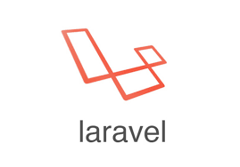
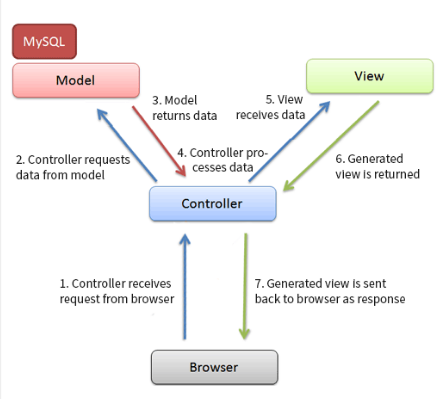

# Technisch
## Gebruikte technologieën

### laravel
Laravel is een open-source full-stack PHP web-framework. Laravel kent een grote populariteit omdat het framework de reputatie heeft gemakkelijk in gebruik te zijn en omdat het voorzien is van een heel leesbare syntax. Ook is het framework  uitstekend [gedocumenteerd](https://laravel.com/docs/5.2) en heeft het een e-learning service genaamd [laracasts](https://laracasts.com/) die de developer helpt bij het gebruiken van het framework.  

<i>Figuur 1: Laravel logo</i>

Het word een full-stack framework genoemd omdat het elk onderdeel van een web-applicatie kan hanteren. Dit gaat van data opslaan in de databank tot het renderen van views door de built-in templating engine. Veel componenten die regelmatig terugkomen bij web applicaties zijn al in het framework ingebakken. Zo verliest de developer geen tijd meer met functionaliteit zoals authentication, sessions, caching, ... te implementeren.  
Ook bieden ze de developer de mogelijkheid tot het gebruik van Laravel Homestead. Dit is een virtuele development environment met alle mogelijke tools die nodig zijn om aan een Laravel project te werken. In deze ontwikkel omgeving zijn volgende programma's inbegrepen:
 
- Ubuntu 14.04
- Git
- PHP 7.0
- HHVM
- Nginx
- MySQL
- MariaDB
- Sqlite3
- Postgres
- Composer
- Node (With PM2, Bower, Grunt, and Gulp)
- Redis
- Memcached
- Beanstalkd

#### Conventie over configuratie
Het framework volgt het principe van conventie over configuratie , dit wil zeggen dat laravel bijna geen configuratie nodig heeft om te starten. Het framework beperkt het aantal keuzes dat de developer moet maken door default configuratie waardes te gebruiken. Uiteraard kunnen deze default waardes verandert worden.
#### Applicatie structuur

Laravel heeft wat beperkingen als het gaat over applicatie structuur. Het forceert de ontwikkelaar een bepaalde mappenstructuur te volgen. In het begin is het vrij moeilijk om mee te werken omdat het project wel wat folders telt maar dit heeft een groot voordeel.
Omdat elke ontwikkelaar geforceerd word om dezelfde structuur aan te houden resulteerd dit op een mappenstructuur die in elk laravel project hetzelfde is. Als er nu later iets moet geimplementeerd worden dan moet men geen tijd verspillen met uit te zoeken waar alles staat.

 

<i>Figuur 2: Applicatie structuur van laravel project</i>.

**App**: de core code van de applicatie , dit houd in : models, controllers, middleware,.. 
**Bootstrap**: enkele files voor het configureren van autoloading, ... (framework files) 
**config**: folder waarin alle configuratie files te vinden zijn. Bijvoorbeeld: database, mail, authenticatie, ... 
**database**: folder waarin alle migration en seeder files te vinden zijn, deze worden gebruikt om aan database management te doen en de database te vullen met data. 
**node_modules**: folder die alle packages bevat die binnengehaald zijn door de npm package manager. 
**public**: public folder, root folder van server dient hiernaar gemapt te worden 
**storage**: deze folder bevat door framework gegenereerde files en applicatie log files. 
**tests**: deze folder bevat al de tests van het project. 
**vendor** deze folder bevat alle dependencies die zijn ingevoerd met composer. 

#### Model-View-Controller
Laravel volgt het MVC (model-view-controller) design pattern , wat wil zeggen dat onze applicatie in 3 delen word gesplitst. 
- **Model**
Het model representeerd de data. Het is volledig onafhankelijk van de view of controller.

- **View**
De view geeft de model data weer, users kunnen interacteren met de view en kunnen hiermee requests sturen naar de server waardoor er een controller actie getriggerd kan worden zoals bijvoorbeeld data opvragen en terugsturen naar de view.

- **Controller**
De controller doet het ontvangen , interpreteren en valideren van user input, data opvragen en updaten van views. Het is een scheiding tussen de view en het model (applicatie logica).

Door dit design pattern te volgen kan de applicatie logica worden gescheiden van de presentatie logica. Deze aanpak zorgt voor een vermindering aan complexiteit in de applicatie. Ook zal het er voor zorgen dat de applicatie heel veel code kan hergebruiken omdat alles gescheiden is van elkaar.
  

<i>Figuur 3: Laravel MVC pattern</i>

#### Artisan
Artisan is een command-line tool die al sinds laravel 3 bij het framework zit , Artisan bied vele commands aan die de ontwikkelaar kunnen helpen om verschillende taken uit te voeren. Hieronder een overzicht van de taken die wij hebben gebruikt in ons project:
 
- **db:seed**
	- Vult de database met dummy data  om zo de applicatie te kunnen testen met werkelijke data in de database 
- **make:Auth**
	- genereert de authenticatie logica en views. 
- **make:controller**
	- genereert een controller met boilerplate code. 
- **make:middleware**
	- genereert middleware met boilerplate code. 
- **make:model**
	- genereert een model met boilerplate code. 
- **make:seeder**
	- genereert een seeder met boilerplate code.  
- **make:migration**
	- genereert een migration met boilerplate code.   
- **migrate**
	- opzetten van de databank aan de hand van migrations.  
- **migrate:refresh**
	- na het toevoegen van een nieuwe migration moest deze command worden uitgevoerd om de databank volledig opnieuw op te zetten. 
- **session:table**
	- Creeërt migration voor de sessie tabel in de DB.  

Door het gebruik van Artisan hebben we heel wat tijd uitgespaard omdat er heel veel skeleton code gewoon kan gegenereerd worden.

#### Composer
Composer is een dependency manager voor PHP, Laravel maakt gebruik van deze dependency manager om zijn dependencies te behandelen. 

<i>Figuur 4: Composer logo</i>

 

Door een composer.json file in de root van het project aan te passen kunnen we dependencies toevoegen aan ons project door het `composer install` command uit te voeren. Dit bied als voordeel dat sommige functionaliteit zo kan geimplementeerd worden zonder dat dit helemaal van 0 moet geprogrammeerd worden. Zo hebben wij enkele dependencies gebruikt in ons project:
- **Laravel collective**
	 Forms is sinds laravel 5 niet meer deel van het framework , als men hier gebruik van wilt maken moet deze dependency toegevoegd worden
- **Intervention image**
	Een open source php bibliotheek waarmee men afbeeldingen kan editeren.
- **laravel-gravatar**
	Bibiliotheek om makkelijk random gravatars te genereren.
- **purifier**
	Bibliotheek om HTML te purifien , dit wil zeggen uitfilteren van bepaalde tags (bv:script tags)

Composer word ook gebruikt om Laravel te installeren. Eerst installeren we de Laravel installer globaal zodat we eender waar een Laravel project kunnen aanmaken dit doen we door deze command uit te voeren.
`composer global require "laravel/installer"`
Door dit te doen kunnen we eender waar een Laravel project aanmaken door de `Laravel new "projectnaam"` command uit te voeren. 
    

### Bootstrap

Voornamelijk voor het grid-systeem en enkele componenten hebben we het Front-end framework bootstrap gebruikt. Het is een combinatie van HTML , CSS en JavaScript code bedoelt om de ontwikkelaar te helpen met het bouwen van user interfaces. Het grote voordeel van Bootstrap is dat het ontwikkel process veel sneller verloopt. Dit framework bied ons design templates die we kunnen gebruiken om onze UI te maken. 
Er zijn onder andere :forms, buttons, tables, carrousel, ... layouts die meteen kunnen geïmplementeerd worden in het project.

<i>Figuur 5: Bootstrap logo</i>

Bootstrap beschikt ook over een geweldig responsive grid systeem dat eenvoudig is in gebruik. Het grid telt 12 kolommen die je kan gebruiken om elementen een bepaalde breedte te geven aan de hand van css klasses. Deze css klasses bestaan voor verschillende beeldformatten zodat men de layout kan definiëren op verschillende devices. Zo bestaan er css klasses voor :

| extra small devices | small devices |medium devices| large devices|
|---------------------|---------------|--------------|--------------|
|.col-xs-			  | col-sm-       |col-md        |col-lg        |
|auto				  |750px		  |970px		 |1170px		|

Het framework is ook cross-platform dus de output zal altijd hetzelfde zijn. Het maakt dus niet uit in welke browser je het project opent.

Om de applicatie performanter te maken kan er op de bootstrap website ook een gecustomizede versie gemaakt worden zodat de developer kan kiezen wat er allemaal gebruikt moet kunnen worden. Dit resulteerd in een kleinere css/js file. De applicatie gebruikt moet dus geen onnodige bootstrap componenten laden.

Om Bootstrap toe te voegen aan ons project gebruiken we de npm package manager. Eens deze package is geïnstalleerd voegen we deze toe aan onze main Sass file zodat dit mee gecompileerd word in de publieke css file. Hetzelfde voor de Javascript file van Bootstrap, de Bootstrap js file word gerequired in de main.js file. Gulp zal dan via de Browserify task dit compileren naar de publieke js file.

### Sass
Sass is een extentie van CSS3 , omdat web applicaties en websites uitgebreider worden met de jaren kunnen we gebruiken maken van deze CSS preprocessor om onze stylesheets modulair en overzichtelijker te maken. 

<i>Figuur 6: Sass logo</i>

Waarom ? Omdat Sass enkele nieuwe features aanbied die men momenteel niet kan gebruiken bij normale CSS , zoals :

- Variabelen:
Door deze feature kunnen we een aantal variabelen aanmaken die we zullen gebruiken doorheen het maken van de applicatie zoals : kleuren ,fonts , margins , line-heights , breakpoints. Het handige aan deze feature is dat als de klant wilt dat bv. een kleur of bv de margins wilt veranderen dan moet dit maar op 1 plaats aangepast worden.

- Partials
Deze feature staat ons toe om onze stylesheets op te delen in verschillende delen zodat we onze css op een heel modulaire manier konden schrijven. Dit is mogelijk door partials aan te maken 
die allemaal worden toegevoegd aan een main.scss bestand op deze manier : `@import('filepath')`. De partials worden aangeduid met een _ voor hun naam zodat sass weet dat dit partials zijn en niet mee moeten gecompileerd worden. Wat er nu wel gecompileerd word is de main.scss file waarin alle partials worden toegevoegd. Zo maakten we voor alles dat logisch gescheiden kon worden van elkaar een partial , dit zorgt voor een overzichtelijker project. Het voordeel van alles te compilen in 1 file is dat het aantal HTTP requests enorm zal dalen tegenover al deze verschillende partials apart.

- Mixins
Omdat sommige css declaraties veel terugkomen kan men gebruik maken van mixins , dit zijn groepjes van css declaraties die men kan hergebruiken doorheen de website. 

- Extends
Met extend kan je de css declaraties van een klasse extenden naar een andere klasse. bv als je een button maakt dan kan je deze extenden en zo een groene en rode knop klasse maken die de button klasse extenden. Op deze manier moet je veel minder code schrijven.

### Gulp
Gulp is een Javascript taskrunner die de ontwikkeling van websites kan versnellen door het automatiseren van algemene taken zoals : compilen van preprocessed CSS (sass) , het minifyen en bundelen van JavaScript , reloaden van de browser,...

<i>Figuur 7: Gulp logo</i>

De installatie gaat als volgt:
- Installeren van Node.js.
- Gulp installeren aan de hand van de package manager van Node.js genaamd npm.

Gulp maakt gebruik van plug-ins die men kan installeren om specifieke taken uit te voeren. Deze plugins kan men installeren via de npm package manager.
Hierna kan men taken declareren in de file 'gulpfile.js' die in de root folder staat. De plug-ins die men wil gebruiken moeten toegevoegd worden bovenaan deze file , daarna worden de taken gedeclareerd.
Voor deze applicatie zijn er enkele taken die moeten worden uitgevoerd namelijk :
- compilen van sass files.
- compilen van js files.

Voor de taken te declareren gebruiken we Laravel Elixir , dit is een soort wrapper rond Gulp. Elixir laat ons toe om op een simpele manier taken te declareren in Gulp, het ondersteunt ook enkele taken dus moeten we deze niet meer toevoegen via npm.

Taken die wij gebruiken van Elixir:
- **Sass compiler**
	Compilet Sass naar Css in public folder
- **Browserify**
	Laat ons toe om dependencies te definieëren zodat browserify dit kan bundelen in één enkele js file => zorgt voor betere performance omdat er maar 1 enkele .js file moet geladen worden.
- **Copy**
	Kopiëren van files naar een andere map.

Bij gulp kan men gebruik maken van streams , dit wil zeggen dat men files door een stream kan sturen van verschillende taken. Deze taken zullen dus allemaal uitgevoerd worden op de files die in de stream worden gestoken.
Gulp kan taken uitvoeren door een bepaald commando in te voeren of zal kijken naar veranderingen in de files die je declareert in de taken. Als er nu iets verandert in deze files zal Gulp de nodige taken  automatisch uitvoeren.

